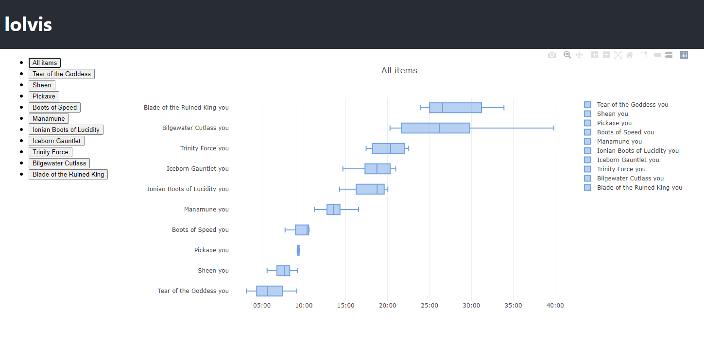
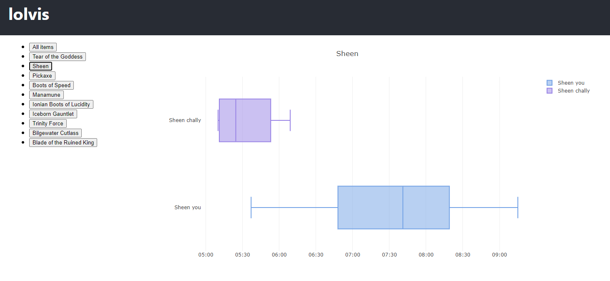

### lolvis
lolvis is a web application that analyzes data from the Riot API to compare your performance in League of Legends to the best players.

* example timeline of item buys, aggregated over your last 20 games:

* example comparison of a specific item buy time compared to a Challenger level player:

### ================================================
This project was bootstrapped with [Create React App](https://github.com/facebook/create-react-app).
